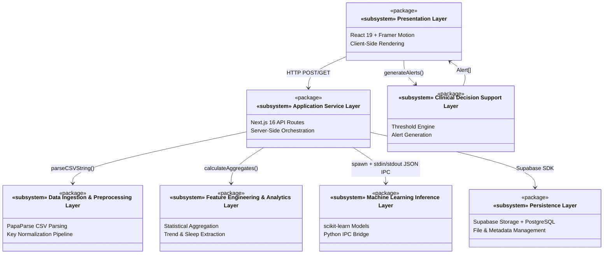
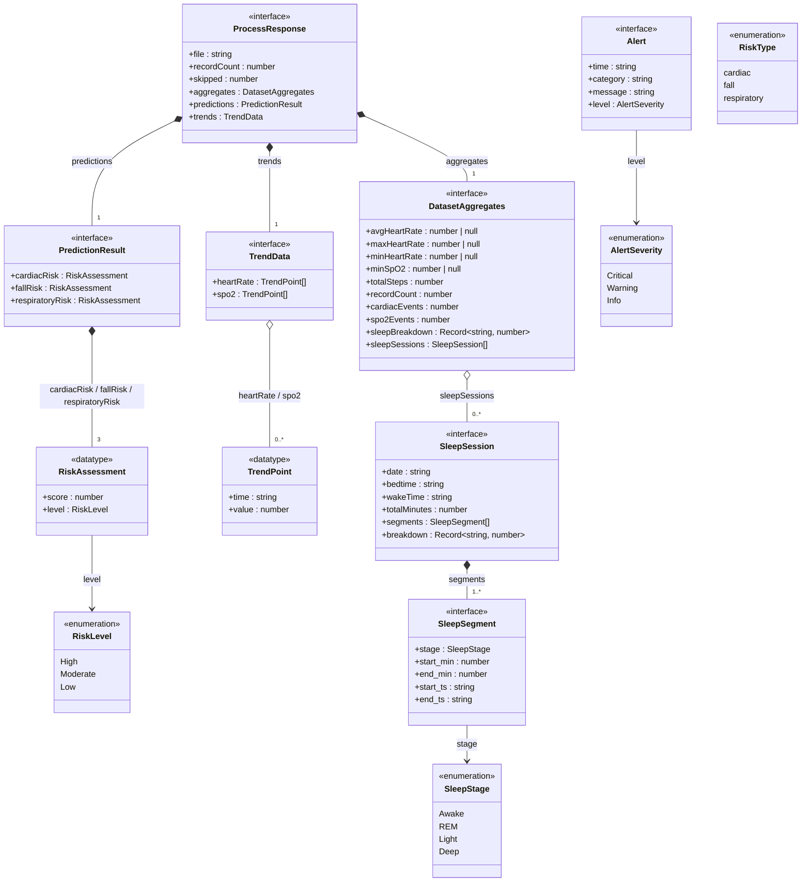
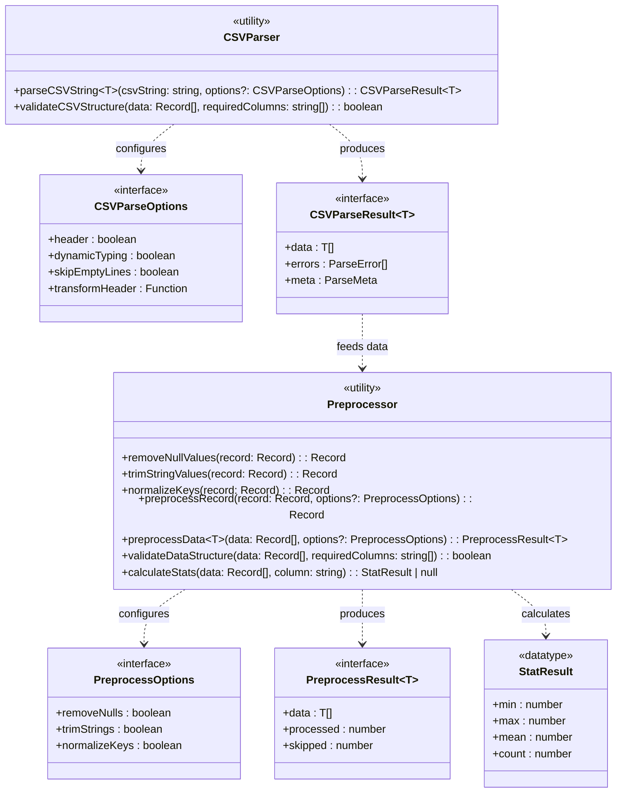
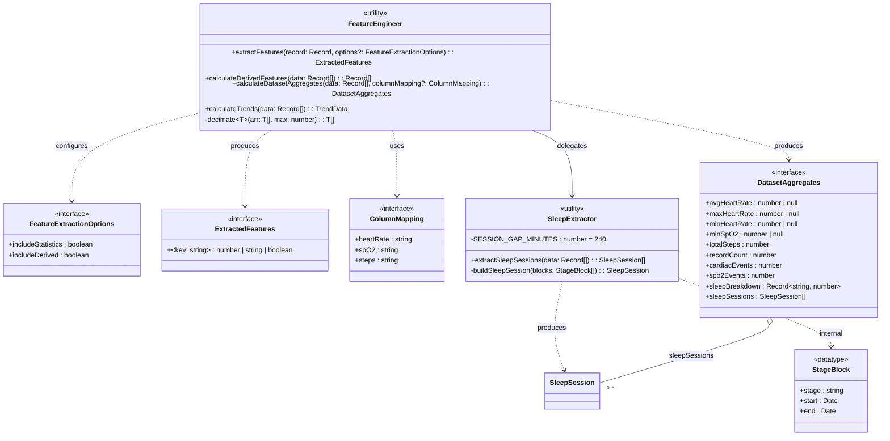
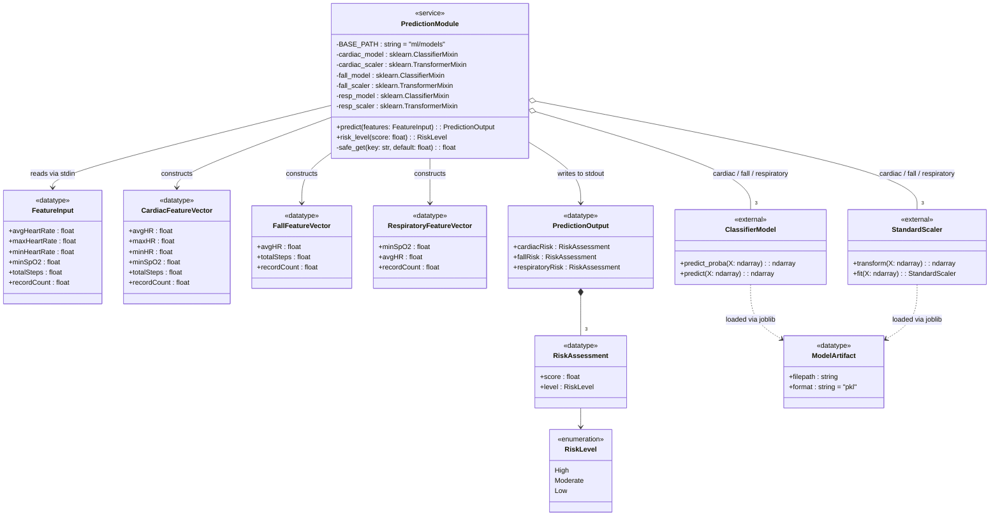
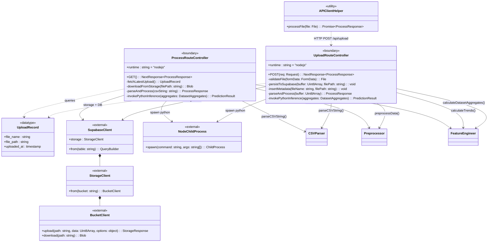
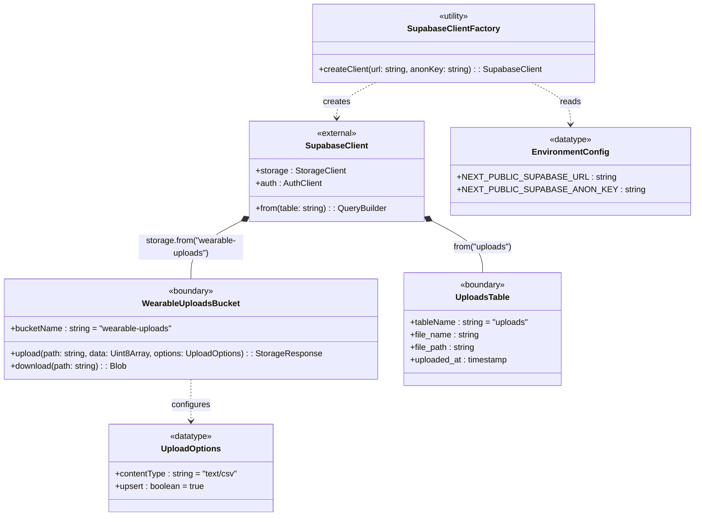

# GeriRisk — UML Class Diagram

> **Notation Standard**: ISO/IEC 19501 (UML 2.5.1) · **Modeling Paradigm**: Logical Design View  
> **Stereotypes**: `«interface»`, `«enumeration»`, `«component»`, `«utility»`, `«service»`, `«datatype»`, `«boundary»`  
> **Tooling**: Mermaid Class Diagram Syntax

---

## 1. System-Level Package Diagram

The GeriRisk platform is decomposed into seven architectural subsystem packages following a strict layered dependency model. Each package encapsulates cohesive responsibilities with well-defined interface contracts at package boundaries.

---

## 2. Core Domain Model — Interfaces & Data Types

This section models the canonical data contracts that flow between subsystem boundaries. All types are derived directly from the TypeScript interface definitions and Python data structures in the codebase.

---

## 3. Data Ingestion & Preprocessing Subsystem

Models the CSV parsing pipeline and data cleaning transformations. The preprocessing pipeline applies a chain-of-responsibility pattern through configurable `PreprocessOptions`.

---

## 4. Feature Engineering & Analytics Subsystem

This subsystem transforms preprocessed tabular records into clinically meaningful aggregate feature vectors and time-series trend data suitable for ML model consumption and dashboard visualization.

---

## 5. Machine Learning Inference Subsystem

Models the Python-based prediction module. The Next.js backend communicates with this subsystem via child process IPC (stdin/stdout JSON serialization). Each risk domain has an independent model-scaler pair following the Strategy pattern.

---

## 6. Clinical Decision Support — Alert Generation Subsystem

The alert generation engine translates quantitative risk predictions and vital sign aggregates into clinically contextualized, severity-graded alert messages using geriatric-specific threshold rules.

```mermaid
classDiagram
    direction TB

    class ClinicalThresholds {
        <<utility>>
        +avgHR_moderate : number = 80
        +avgHR_high : number = 100
        +maxHR_moderate : number = 110
        +maxHR_high : number = 130
        +minHR_low : number = 50
        +minSpO2_moderate : number = 95
        +minSpO2_critical : number = 92
        +totalSteps_veryLow : number = 500
        +totalSteps_low : number = 2000
        +cardiacEvents_moderate : number = 1
        +cardiacEvents_high : number = 4
        +spo2Events_moderate : number = 1
        +spo2Events_high : number = 3
    }

    class AlertGenerator {
        <<utility>>
        +generateAlerts(data: ProcessResponse) : Alert[]
        +generateSubtext(type: RiskType, data: ProcessResponse) : string
        -evaluateCardiacAlerts(agg: DatasetAggregates, pred: PredictionResult) : Alert[]
        -evaluateRespiratoryAlerts(agg: DatasetAggregates, pred: PredictionResult) : Alert[]
        -evaluateFallRiskAlerts(agg: DatasetAggregates, pred: PredictionResult) : Alert[]
    }

    class Alert {
        <<interface>>
        +time : string
        +category : string
        +message : string
        +level : AlertSeverity
    }

    class AlertSeverity {
        <<enumeration>>
        Critical
        Warning
        Info
    }

    class RiskType {
        <<enumeration>>
        cardiac
        fall
        respiratory
    }

    AlertGenerator ..> ClinicalThresholds : applies rules from
    AlertGenerator ..> ProcessResponse : reads
    AlertGenerator ..> Alert : produces
    AlertGenerator ..> RiskType : parameterizes subtext
    Alert --> AlertSeverity : severity classification
```

---

## 7. Application Service Layer — API Route Controllers

The server-side orchestration controllers act as the system's integration backbone, coordinating file ingestion, preprocessing, feature engineering, ML inference, and persistence within a single request-response cycle.

---

## 8. Presentation Layer — Component Architecture

Models the React component hierarchy on the dashboard. Each component receives typed props and renders a specific visualization module. Components are composed within the `DashboardPage` container following the Composite pattern.

```mermaid
classDiagram
    direction TB

    class DashboardPage {
        <<component>>
        -data : ProcessResponse | null
        -filename : string
        -loading : boolean
        +useEffect() : void
        +render() : JSX.Element
    }

    class LandingPage {
        <<component>>
        +render() : JSX.Element
    }

    class UploadPage {
        <<component>>
        -file : File | null
        -status : UploadStatus
        -fileInputRef : RefObject~HTMLInputElement~
        +handleUpload() : Promise~void~
        +render() : JSX.Element
    }

    class LoginPage {
        <<component>>
        +render() : JSX.Element
    }

    class UploadStatus {
        <<enumeration>>
        idle
        uploading
        success
        error
    }

    class RiskCardProps {
        <<interface>>
        +type : RiskType
        +score : number
        +level : RiskLevel
        +events : number
        +label : string
        +subtext : string
    }

    class RiskCard {
        <<component>>
        +props : RiskCardProps
        -getColors() : string
        -getBadgeColors() : string
        -getIcon() : JSX.Element
        +render() : JSX.Element
    }

    class MetricCardProps {
        <<interface>>
        +title : string
        +value : string | number
        +unit : string
        +icon : ReactNode
    }

    class MetricCard {
        <<component>>
        +props : MetricCardProps
        +render() : JSX.Element
    }

    class SparklinePoint {
        <<interface>>
        +time : string
        +value : number
    }

    class SparklineChartProps {
        <<interface>>
        +data : SparklinePoint[]
        +dataKey : string
        +color : string
        +label : string
        +unit : string
    }

    class SparklineChart {
        <<component>>
        +props : SparklineChartProps
        +render() : JSX.Element
    }

    class AlertPanel {
        <<component>>
        +alerts : Alert[]
        +render() : JSX.Element
    }

    class ActivityRingProps {
        <<interface>>
        +steps : number
        +goal : number
    }

    class ActivityRing {
        <<component>>
        +props : ActivityRingProps
        -percentage : number
        -circumference : number
        -strokeDashoffset : number
        -caloriesBurned : number
        +render() : JSX.Element
    }

    class SleepTimelineProps {
        <<interface>>
        +sessions : SleepSession[]
    }

    class SleepTimeline {
        <<component>>
        +props : SleepTimelineProps
        +render() : JSX.Element
    }

    class SessionChart {
        <<component>>
        +session : SleepSession
        -ticks : TimeTick[]
        +render() : JSX.Element
    }

    class SleepDistributionProps {
        <<interface>>
        +breakdown : Record~string, number~
    }

    class SleepDistribution {
        <<component>>
        +props : SleepDistributionProps
        +render() : JSX.Element
    }

    class DataTable {
        <<component>>
        +data : ProcessResponse
        -getHeartRateStatus(bpm: number, type: string) : string
        -getSpO2Status(value: number) : string
        -getStepsStatus(steps: number) : string
        +render() : JSX.Element
    }

    class Doctor {
        <<interface>>
        +name : string
        +specialty : string
        +bio : string
        +email : string
    }

    class BookAppointment {
        <<component>>
        -selectedDate : Date
        -selectedDoctor : Doctor | null
        -weekDays : Date[]
        -doctorStatuses : AvailabilityStatus[]
        +hashStatus(doctorIndex: number, date: Date) : AvailabilityStatus
        +getWeekDays(selectedDate: Date) : Date[]
        +render() : JSX.Element
    }

    class AvailabilityStatus {
        <<enumeration>>
        Available
        FullBook
    }

    class RootLayout {
        <<component>>
        +metadata : Metadata
        -inter : NextFont
        -dmSerifDisplay : NextFont
        -ibmPlexMono : NextFont
        +render(children: ReactNode) : JSX.Element
    }

    class StageConfig {
        <<datatype>>
        +color : string
        +label : string
        +y : number
        +height : number
    }

    RootLayout *-- DashboardPage : routes /dashboard
    RootLayout *-- LandingPage : routes /
    RootLayout *-- UploadPage : routes /upload
    RootLayout *-- LoginPage : routes /login

    DashboardPage *-- "4" MetricCard : vital metrics
    DashboardPage *-- "3" RiskCard : risk predictions
    DashboardPage *-- "2" SparklineChart : HR + SpO2 trends
    DashboardPage *-- "1" ActivityRing : step progress
    DashboardPage *-- "1" SleepTimeline : sleep visualization
    DashboardPage *-- "1" DataTable : detailed metrics
    DashboardPage *-- "1" AlertPanel : clinical alerts
    DashboardPage *-- "1" BookAppointment : care coordination

    SleepTimeline *-- "1..*" SessionChart : per-session

    RiskCard ..> RiskCardProps : typed by
    MetricCard ..> MetricCardProps : typed by
    SparklineChart ..> SparklineChartProps : typed by
    ActivityRing ..> ActivityRingProps : typed by
    SleepTimeline ..> SleepTimelineProps : typed by
    SleepDistribution ..> SleepDistributionProps : typed by
    BookAppointment o-- "7" Doctor : doctors roster
    BookAppointment --> AvailabilityStatus : per doctor/date
    UploadPage --> UploadStatus : state machine
    SessionChart ..> StageConfig : rendering config
```

---

## 9. Persistence Layer — Supabase Architecture

---

## 10. End-to-End Data Flow — Integrated Class Collaboration

This diagram captures the complete request lifecycle from CSV upload through prediction to dashboard rendering, showing how all subsystem classes collaborate.

```mermaid
classDiagram
    direction LR

    class User {
        <<actor>>
        +uploadCSV(file: File) : void
        +viewDashboard() : void
        +bookAppointment() : void
    }

    class APIClientHelper {
        <<utility>>
        +processFile(file: File) : Promise~ProcessResponse~
    }

    class UploadRouteController {
        <<boundary>>
        +POST(req: Request) : NextResponse
    }

    class CSVParser {
        <<utility>>
        +parseCSVString(csv: string) : CSVParseResult
    }

    class Preprocessor {
        <<utility>>
        +preprocessData(data: Record[]) : PreprocessResult
    }

    class FeatureEngineer {
        <<utility>>
        +calculateDatasetAggregates(data: Record[]) : DatasetAggregates
        +calculateTrends(data: Record[]) : TrendData
    }

    class SleepExtractor {
        <<utility>>
        +extractSleepSessions(data: Record[]) : SleepSession[]
    }

    class PredictionModule {
        <<service>>
        +predict(features: FeatureInput) : PredictionOutput
    }

    class AlertGenerator {
        <<utility>>
        +generateAlerts(data: ProcessResponse) : Alert[]
    }

    class SupabaseClient {
        <<external>>
        +storage : StorageClient
        +from(table: string) : QueryBuilder
    }

    class LocalStorage {
        <<boundary>>
        +setItem(key: string, value: string) : void
        +getItem(key: string) : string
    }

    class DashboardPage {
        <<component>>
        +render() : JSX.Element
    }

    User --> APIClientHelper : 1. processFile()
    APIClientHelper --> UploadRouteController : 2. HTTP POST
    UploadRouteController --> SupabaseClient : 3. persist file + metadata
    UploadRouteController --> CSVParser : 4. parse CSV
    CSVParser --> Preprocessor : 5. raw records
    Preprocessor --> FeatureEngineer : 6. cleaned records
    FeatureEngineer --> SleepExtractor : 7. extract sleep
    FeatureEngineer --> PredictionModule : 8. aggregates via IPC
    PredictionModule --> UploadRouteController : 9. predictions JSON
    UploadRouteController --> APIClientHelper : 10. ProcessResponse
    APIClientHelper --> LocalStorage : 11. store result
    LocalStorage --> DashboardPage : 12. load on mount
    DashboardPage --> AlertGenerator : 13. generate alerts
    AlertGenerator --> DashboardPage : 14. Alert[]
```

---

## Appendix A — Relationship Legend

| UML Relationship | Mermaid Syntax | Semantic Meaning |
|---|---|---|
| **Composition** | `*--` | Strong ownership; child cannot exist without parent |
| **Aggregation** | `o--` | Weak ownership; child can exist independently |
| **Dependency** | `..>` | Uses / depends on (transient) |
| **Association** | `-->` | Structural link (navigable) |
| **Realization** | `..\|>` | Implements interface |

## Appendix B — Stereotype Definitions

| Stereotype | UML Meaning | GeriRisk Usage |
|---|---|---|
| `«interface»` | Abstract contract specifying attributes and operations | TypeScript interfaces (`ProcessResponse`, `Alert`, etc.) |
| `«enumeration»` | Fixed set of named values | `RiskLevel`, `SleepStage`, `AlertSeverity`, `UploadStatus` |
| `«datatype»` | Value type without identity | `TrendPoint`, `RiskAssessment`, `StageBlock` |
| `«utility»` | Stateless class with only static operations | `CSVParser`, `Preprocessor`, `FeatureEngineer`, `AlertGenerator` |
| `«service»` | Stateful class providing domain operations | `PredictionModule` (loads models once, serves predictions) |
| `«component»` | React UI component with render lifecycle | All dashboard visualization components |
| `«boundary»` | System boundary / external interface | API routes, Supabase buckets/tables |
| `«external»` | Third-party library class | `SupabaseClient`, `StandardScaler`, `ClassifierModel` |
| `«subsystem»` | Package grouping related classes | Architectural layer packages |
| `«actor»` | External entity interacting with the system | `User` (caregiver / clinician) |

## Appendix C — Design Pattern Catalog

| Pattern | Location | Rationale |
|---|---|---|
| **Strategy** | `PredictionModule` with 3 model-scaler pairs | Each risk domain uses independent ML pipeline with swappable models |
| **Chain of Responsibility** | `preprocessRecord()` pipeline | Configurable transformation chain (nulls → trim → normalize) |
| **Composite** | `DashboardPage` → child components | Dashboard composes heterogeneous visualization widgets |
| **Observer** | React `useEffect` + `localStorage` | Dashboard reactively loads data on mount |
| **Façade** | `UploadRouteController` | Single API endpoint orchestrates 6+ subsystem operations |
| **Factory** | `SupabaseClientFactory` | Centralized Supabase client creation with environment config |
| **Template Method** | `generateAlerts()` | Fixed alert evaluation structure with per-domain rule specialization |
