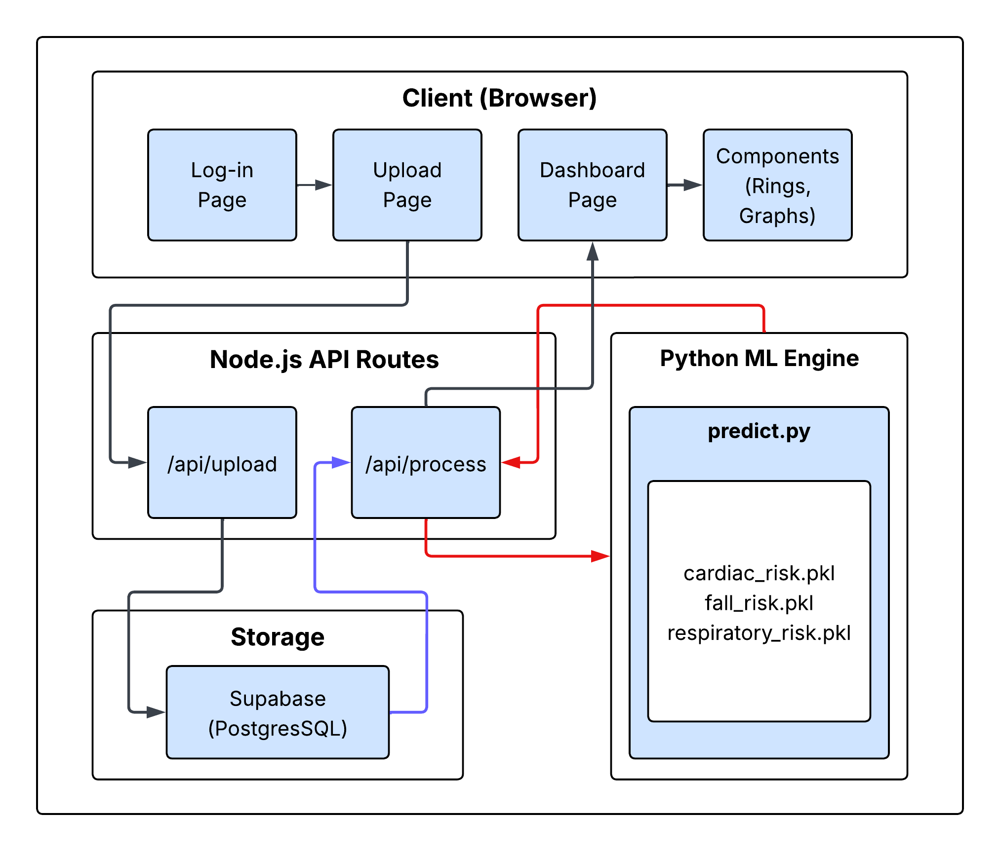

<div align="center">

# 


**AI-Powered Health Risk Prediction for Elderly Care**

[](https://nextjs.org/)
[](https://react.dev/)
[](https://www.typescriptlang.org/)
[](https://tailwindcss.com/)
[](https://www.python.org/)
[](https://supabase.com/)
[](./LICENSE)

<br />

GeriRisk is a wearable-data health monitoring system designed for **senior care**. It ingests real-time metrics — heart rate, SpO₂, steps, sleep, and temperature — and uses **machine-learning models** to predict cardiac stress, fall likelihood, and respiratory irregularities. Results are presented through an intuitive, alert-driven dashboard so caregivers can act fast.

<br />

[Features](#features) · [Tech Stack](#tech-stack) · [Architecture](#architecture) · [Project Structure](#project-structure) · [Getting Started](#getting-started)· [API Reference](#api-reference) · [License](#license)

</div>

---

## Features
<p align="center">

| Category                | Highlights                                                                                          |
| ----------------------- | --------------------------------------------------------------------------------------------------- |
| **ML Risk Prediction**  | Cardiac stress · Fall likelihood · Respiratory risk — each scored with High / Moderate / Low levels |
| **CSV Upload Pipeline** | Drag-and-drop wearable data upload → preprocessing → feature extraction → ML inference              |
| **Real-Time Dashboard** | Sparkline charts · Activity rings · Sleep timeline & distribution panels · Risk score cards         |
| **Intelligent Alerts**  | Data-driven alert engine with contextual clinical messages and severity-based prioritization        |
| **Book Appointment**    | In-dashboard appointment scheduling with doctor availability based on selected dates               |
| **Data Persistence**    | Supabase-backed storage for all uploaded health records                                             |
| **Apple-Inspired UI**   | Clean, minimal design with Inter typography, smooth Framer Motion animations & glassmorphic cards    |

</p>

---

## Tech Stack

### Frontend
<div align="center">

| Technology         | Purpose                                      |
| ------------------ | -------------------------------------------- |
| **Next.js 16**     | React framework with App Router & API routes |
| **React 19**       | Component library with the React Compiler    |
| **TypeScript 5**   | Type-safe development                        |
| **Tailwind CSS 4** | Utility-first styling with CSS variables      |
| **Framer Motion**  | Smooth, Apple-like animations & transitions   |
| **Recharts**       | Data visualization (sparklines, charts)      |
| **Lucide React**   | Icon system                                  |
| **Inter Font**     | Typography (via next/font/google)            |

</div>


### Backend & ML

<div align="center">

| Technology             | Purpose                                                       |
| ---------------------- | ------------------------------------------------------------- |
| **Next.js API Routes** | `/api/upload` and `/api/process` endpoints                    |
| **Python 3**           | ML inference runtime                                          |
| **scikit-learn**       | Pre-trained risk models (Random Forest / Logistic Regression) |
| **NumPy & Joblib**     | Numerical computation & model serialization                   |

</div>

### Infrastructure

<div align="center">

| Technology    | Purpose                              |
| ------------- | ------------------------------------ |
| **Supabase**  | PostgreSQL database + authentication |
| **PapaParse** | Client-side CSV parsing              |

</div>

---

## Architecture





---

## Project Structure

```
GeriRisk/
├── geririsk-ai/                  # Main application
│   ├── ml/                       # Machine learning module
│   │   ├── models/               # Pre-trained model files (.pkl)
│   │   │   ├── cardiac_risk_model.pkl
│   │   │   ├── cardiac_scaler.pkl
│   │   │   ├── fall_risk_model.pkl
│   │   │   ├── fall_scaler.pkl
│   │   │   ├── respiratory_risk_model.pkl
│   │   │   └── respiratory_scaler.pkl
│   │   └── predict.py            # Inference entry point
│   ├── public/                   # Static assets & branding
│   ├── src/
│   │   ├── app/
│   │   │   ├── api/
│   │   │   │   ├── upload/       # CSV upload endpoint
│   │   │   │   └── process/      # ML processing endpoint
│   │   │   ├── dashboard/        # Patient dashboard page
│   │   │   ├── upload/           # Upload wizard page
│   │   │   ├── login/            # Authentication page
│   │   │   ├── page.tsx          # Landing page
│   │   │   ├── layout.tsx        # Root layout
│   │   │   └── globals.css       # Global styles
│   │   ├── components/
│   │   │   ├── ActivityRing.tsx   # Circular progress rings
│   │   │   ├── AlertPanel.tsx     # Risk alert notifications
│   │   │   ├── BookAppointment.tsx # Doctor appointment scheduler
│   │   │   ├── DataTable.tsx      # Tabular data display
│   │   │   ├── MetricCard.tsx     # KPI metric tiles
│   │   │   ├── RiskCard.tsx       # Risk score display cards
│   │   │   ├── SleepDistribution.tsx
│   │   │   ├── SleepTimeline.tsx
│   │   │   └── SparklineChart.tsx
│   │   └── lib/
│   │       ├── api.ts            # Client-side API helpers
│   │       ├── csvParser.ts      # CSV parsing utilities
│   │       ├── features.ts       # Feature engineering logic
│   │       ├── generateAlerts.ts # Intelligent alert generation engine
│   │       ├── preprocess.ts     # Data preprocessing pipeline
│   │       └── supabaseClient.ts # Supabase client singleton
│   ├── package.json
│   ├── tsconfig.json
│   └── next.config.ts
├── requirements.txt              # Python dependencies
├── LICENSE                       # MIT License
└── README.md
```

---

## Getting Started

### Prerequisites

<div align="center">

| Tool                 | Version                               |
| -------------------- | ------------------------------------- |
| **Node.js**          | ≥ 18.x                                |
| **npm**              | ≥ 9.x                                 |
| **Python**           | ≥ 3.10                                |
| **Supabase Account** | [supabase.com](https://supabase.com/) |

</div>

### 1. Clone the Repository

```bash
git clone https://github.com/atharvapawar9/GeriRisk.git
cd GeriRisk
```

### 2. Install Python Dependencies

```bash
pip install -r requirements.txt
```

### 3. Install Node.js Dependencies

```bash
cd geririsk-ai
npm install
```

### 4. Configure Environment Variables

Create a `.env.local` file inside `geririsk-ai/`:

```env
NEXT_PUBLIC_SUPABASE_URL=your_supabase_project_url
NEXT_PUBLIC_SUPABASE_ANON_KEY=your_supabase_anon_key
```

> **Note:** You can find these values in your [Supabase project dashboard](https://app.supabase.com/) under **Settings → API**.

### 5. Run the Development Server

```bash
npm run dev
```

The app will be available at **[http://localhost:3000](http://localhost:3000)**.

---

## API Reference

### `POST /api/upload`

Upload a CSV file containing wearable health data.

<div align="center">

| Parameter | Type       | Description                  |
| --------- | ---------- | ---------------------------- |
| `file`    | `FormData` | CSV file with health metrics |

</div>

### `POST /api/process`

Run ML inference on preprocessed feature data.

**Request Body (JSON):**

```json
{
  "avgHeartRate": 78,
  "maxHeartRate": 120,
  "minHeartRate": 55,
  "minSpO2": 94,
  "totalSteps": 3200,
  "recordCount": 48
}
```

**Response:**

```json
{
  "cardiacRisk": { "score": 0.312, "level": "Low" },
  "fallRisk": { "score": 0.651, "level": "Moderate" },
  "respiratoryRisk": { "score": 0.142, "level": "Low" }
}
```


---


## License

Distributed under the **MIT License**. See [`LICENSE`](./LICENSE) for more information.

---

## Design Philosophy

GeriRisk's frontend follows an modern design language:

- **Typography**: Inter font family (closest to SF Pro available via Google Fonts)
- **Color Palette**: Deep brand blue `#0000c9` primary with `#a8bcff` accents, Apple's `#f5f5f7` warm gray for section backgrounds, `#1d1d1f` charcoal footer
- **Corners & Shadows**: Large `1rem` border-radius with soft, diffused box-shadows
- **Animations**: Smooth Framer Motion entrances with custom cubic-bezier easing curves
- **Glass Effects**: Frosted-glass navbar with `backdrop-blur` and `backdrop-saturate`

---

<div align="center">


</div>
