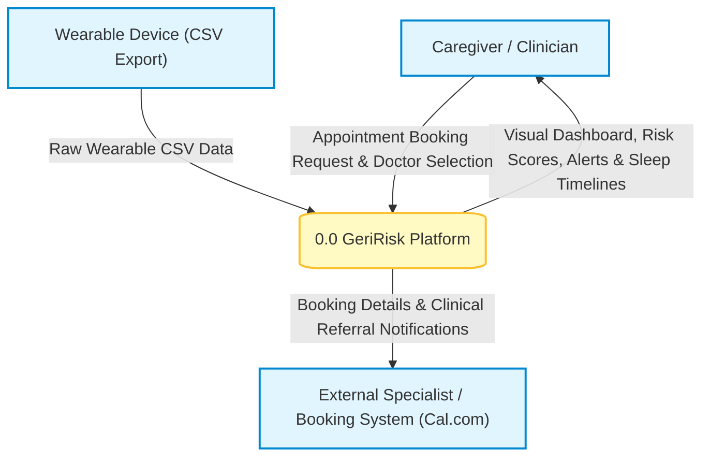
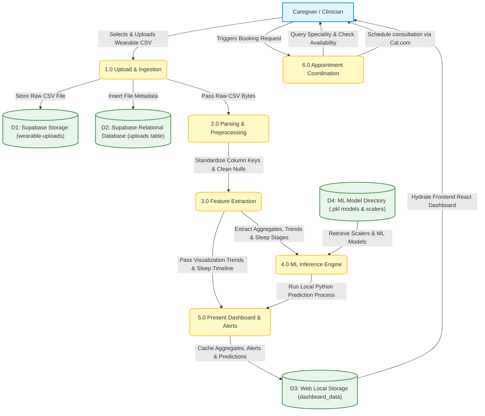
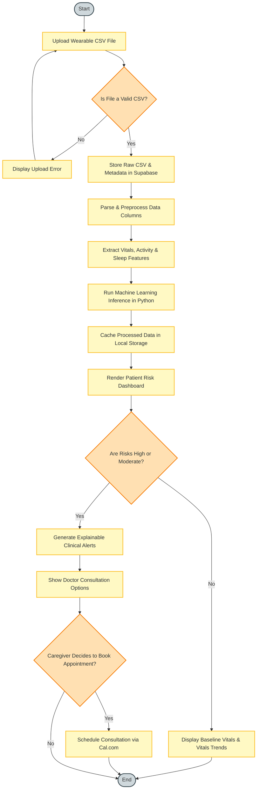
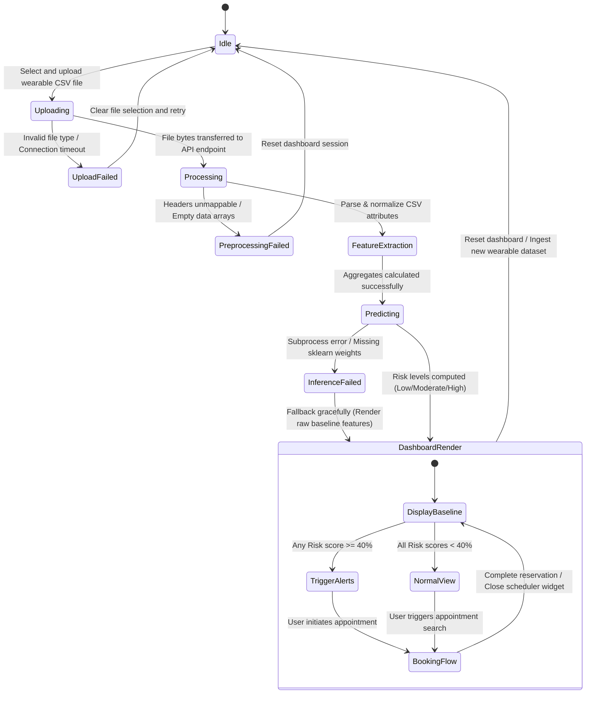

# GeriRisk: System Specification and Architecture Design


## Level 0 Data Flow Diagram (Context Diagram)

The Level 0 diagram shows the system boundary of GeriRisk, highlighting the flow of wearable biometrics from external sources and the delivery of visual risk alerts and appointment integrations to care teams.



## Level 1 Data Flow Diagram (Process Decomposition)

The Level 1 diagram decomposes the GeriRisk platform into its operational processes, databases, and localized inference tasks, mapping exactly how data transitions from raw formats to predictive scores.



## Activity Diagram

The Activity diagram represents the sequential workflow and decision paths taken by the GeriRisk system and users during ingestion, processing, prediction, and follow-up.



---

## 6.4.3 Non-Functional Requirements

### 1. Interface Requirements
*   **User Interface (UI) Accessibility & Layout:** The web application dashboard must adhere to modern responsive styling, dynamically adjusting layouts for desktop, tablet, and mobile displays to ensure care teams can scan health risks on any device.
*   **Ingestion Portability:** The platform must expose an easy-to-use CSV dropzone that guides users with clear schema guidelines, detailing acceptable formats for continuous biometric records (e.g., standard Garmin, Fitbit, or Apple Health CSV layouts).
*   **Triage Visualization Standards:** Visual indicators for Cardiac, Fall, and Respiratory risk models must utilize persistent, high-contrast HSL color states—using green/primary for Low, amber for Moderate, and red/destructive for High risk states—to prevent visual ambiguity.
*   **Integration Boundary Connections:** The backend interface must maintain robust connections to Supabase PostgreSQL endpoints for transactional metadata records and secure object storage buckets for raw file telemetry. The appointment module must securely frame external scheduling widgets (e.g., Cal.com embedding) to support instant consultation bookings.

### 2. Performance Requirements
*   **Ingestion & Parsing Throughput:** The platform must parse raw multi-variable wearable CSV files of up to 10MB (approximately 50,000 physiological telemetry records) in under 500 milliseconds using PapaParse client-side or server-side streams.
*   **Machine Learning Inference Latency:** Spawning the local Python inference engine, scaling aggregates via `StandardScaler`, and returning standardized JSON risk probability objects must execute in under 1.0 second.
*   **Visual Dashboard Rendering:** Once data is processed, the React frontend must hydrate and render all charts, sleep timelines, and metric cards from local cache in less than 1.5 seconds, avoiding noticeable interface lags.

### 3. Software Quality Attributes

#### Availability & Reliability
*   **High Availability:** The cloud backend, APIs, and database components hosted on Supabase and Vercel must operate with a targeted availability metric of 99.9% uptime.
*   **Graceful Degradation & Fault Tolerance:** In the event of backend network latency, database disconnects, or Python prediction subprocess failures, the system must degrade gracefully. Instead of displaying a fatal application crash, the dashboard must fall back to showing descriptive statistical aggregates (e.g., standard average heart rate or minimum SpO2) and present a warning indicating that machine learning risk scores are temporarily unavailable.

#### Modifiability (includes Portability, Reusability, and Scalability)
*   **Modifiability & Extensibility:** The machine learning prediction pipeline must be decoupled from the core application logic. This allows developers to update, recalibrate, or swap individual scikit-learn models (or scale to deep learning classifiers such as LSTMs) inside `ml/predict.py` without modifying the Next.js API orchestration paths or the frontend React presentation components.
*   **Portability:** The web application and server-side components must be fully portable, executing consistently across all major web browsers (Chrome, Safari, Firefox, Edge) and compatible with standard serverless hosting networks or Dockerized environments.
*   **Reusability:** Data preprocessing (`preprocess.ts`) and clinical feature extraction modules (`features.ts`) must be packaged as isolated utility functions. This ensures they can be reused in future real-time streaming modules or background processing daemons without code duplication.
*   **Scalability:** Relational transactional tables must scale automatically under database indexing. Ingestion streams must utilize memory-efficient chunked buffers to prevent heap overflow issues when multiple clinicians upload datasets concurrently.

#### Security
*   **Data in Transit:** All patient telemetry uploads and communications between client dashboards and backend API routes must be encrypted using secure Transport Layer Security (TLS/HTTPS).
*   **Data at Rest & Isolation:** Raw CSV files stored in Supabase object buckets must be governed by strict Row-Level Security (RLS) and storage access policies, restricting file retrieval to authorized care accounts.
*   **Privacy & Anonymization:** The ingestion pipeline must strip identifiable personal descriptors (such as names, healthcare IDs, or addresses) from processing paths. The Python ML script must only consume anonymized, numeric arrays to compute risk matrices.

#### Testability
*   **Separation of concerns:** Utility classes for key extraction, text parsing, and standard deviation checks must be independent of database sessions or server runtimes. This allows developers to run automated Jest/Vitest unit tests locally on the feature calculations.
*   **Localized Script Testing:** The Python machine learning logic must support command-line arguments to feed mock feature JSON files through stdin, allowing developers to isolate and verify scikit-learn probability distributions locally.

#### Usability (includes Self-Adaptability and User-Adaptability)
*   **Usability & Alert Moderation:** The dashboard layout must display key baseline metrics prominently at the top, grouping clinical notifications in a secondary sidebar to mitigate alert fatigue.
*   **Self-Adaptability:** The preprocessing module must adapt automatically to schema variations across popular wearable exports. If column titles arrive named as `"HR"`, `"heartrate"`, or `"heart_rate"`, the standardization mapping must recognize and transform the fields dynamically without requiring manual configuration from the user.
*   **User-Adaptability:** The user interface must support individual adjustments, allowing clinicians to configure highlight zones or adjust activity threshold benchmarks (e.g., customizing steps goals or heart rate limits) depending on the specific baseline mobility profile of a given geriatric patient.

---

## State Diagram

The State Diagram defines the operational lifecycle states of the GeriRisk prediction and dashboard session, highlighting transitions from file upload to backend analytics, ML execution, and interactive caregiver views.



---

## 6.4.5 Design Constraints

### 1. Language, Framework & Runtime Environment Constraints
*   **Frontend-Backend Framework:** The user interface and orchestration API endpoints must operate within a Next.js (TypeScript) runtime. Component composition is restricted to React, with styling compiled through Tailwind CSS.
*   **Machine Learning Runtime:** Risk predictors are restricted to execution inside a Python 3.x virtual environment. The inference script must utilize pre-trained models serialized as Joblib `.pkl` structures, employing only standard scientific computing libraries (`scikit-learn`, `numpy`, `joblib`).
*   **Interprocess Execution Boundary:** For the localized deployment flow, the system must not establish permanent gRPC microservices, background TCP daemons, or HTTP services to access prediction logic. The Next.js server-side endpoint is constrained to executing the Python ML script as an isolated child process via `child_process.spawn`. Features must be sent strictly as stringified JSON through the process's standard input (`stdin`), and predictions retrieved through standard output (`stdout`).

### 2. Data Formatting & Schema Ingestion Constraints
*   **Data Ingestion Shape:** The platform is designed strictly around tabular, time-series wearable exports in CSV format. Dynamic schema mappings are constrained to mapping key biometric indicators (specifically `heart_rate`, `spo2`, `steps`, and sleep-state definitions). Input files lacking temporal timestamps or readable vitals headings will fail parsing validation.

### 3. Database, Object Storage & Cloud Persistence Boundaries
*   **Supabase Client Scope:** File upload storage and metadata transactional logging are constrained to Supabase platform endpoints. Database operations must interact via Supabase database libraries using security rules (RLS policies) to isolate patient logs, preventing unauthenticated read/write access.

---

## 6.4.6 Software Interface Description

### 1. User Interface (Human-Computer Interface)
*   **Visual Dashboard:** The React application interface displays tabular health records, sleep timelines (decomposed into Awake, REM, Light, and Deep states), sparkline charts utilizing Recharts, and color-coded risk cards.
*   **Drag-and-Drop Dropzone:** Exposes an interactive file upload component allowing caregivers and clinicians to select and upload patient CSV telemetry files from their local storage systems.

### 2. Hardware / Device File Interface
*   **Wearable Telemetry Uploads:** The application does not interface directly with physical smartwatch hardware via Bluetooth or USB ports. Instead, it interacts with device outputs via a standard local file-system dialog window, permitting the user to choose exports generated from wearable ecosystems (e.g., Fitbit, Garmin, Apple Health).

### 3. Backend & Cloud Integration Interfaces
*   **Supabase Storage Bucket API:** The application uploads raw CSV files to Supabase Object Storage using an HTTP-based multipart form boundary directed at the `wearable-uploads` bucket.
*   **Supabase Database API:** Database updates are completed via HTTPS requests using REST-based transactional routes to write file status, original names, and path references to the relational `uploads` metadata table.

### 4. External Services Interfaces
*   **Cal.com Scheduling Embedding:** The dashboard integrates with Cal.com via a framed secure widget overlay. It sends physician index parameters and selected dates to Cal.com's public booking scheduling API to query doctor slot availability and submit confirmation requests.
*   **Mail Client Protocol:** When clinicians trigger urgent consultations, the application launches local system mail handles via standard `mailto:` boundaries, setting target physician email addresses and formatting subject/body lines with generated alert descriptions.

### 5. Internal Interprocess Communication (IPC) Interface
The Next.js endpoint exchanges processing data with the Python machine learning pipeline (`ml/predict.py`) using standard system streams:
*   **Input Interface (stdin):** Receives a stringified JSON payload with calculated dataset feature aggregates, following a structured TypeScript type definition mapping:
    ```typescript
    {
      avg_hr: number;
      max_hr: number;
      min_hr: number;
      min_spo2: number;
      total_steps: number;
      record_count: number;
    }
    ```
*   **Output Interface (stdout):** Returns a stringified JSON payload containing probability floats and categorical string risk ratings (Low/Moderate/High):
    ```json
    {
      "cardiacRisk": { "score": 0.18, "level": "Low" },
      "fallRisk": { "score": 0.42, "level": "Moderate" },
      "respiratoryRisk": { "score": 0.81, "level": "High" }
    }
    ```

---

## 7.3 Data Design (using Appendices A and B)

This section maps all structured database entities, physical file storage formats, and memory-resident data objects that form the GeriRisk data management boundary.

### 7.3.1 Internal Software Data Structure

These are transient data shapes passed internally between client components, Next.js endpoint handlers, and the Python prediction subprocess during processing:

#### 1. Preprocessing Telemetry Types
*   **`RawRecord` / `NormalizedRecord`:** Represent parsed single-row tabular lines from the wearable export.
    ```typescript
    interface NormalizedRecord {
      timestamp: string;      // ISO-8601 or standard datetime string
      heart_rate?: number;    // Heart rate telemetry in bpm
      spo2?: number;          // SpO2 percentage (0 - 100)
      steps?: number;         // Cumulative step increments
      sleep_stage?: string;   // "Awake", "REM", "Light", "Deep" sleep state
    }
    ```

#### 2. Clinical Feature Extract Types (`features.ts`)
*   **`DatasetAggregates`:** Compiled summary profile calculated during feature extraction to serve as features for prediction models:
    ```typescript
    interface DatasetAggregates {
      avgHeartRate: number;      // Average computed heart rate
      maxHeartRate: number;      // Maximum logged heart rate
      minHeartRate: number;      // Minimum logged heart rate
      minSpO2: number;           // Critical minimum SpO2 reading
      totalSteps: number;        // Sum of all steps inside session
      recordCount: number;       // Denominator representing active data points
      cardiacEvents: number;     // Count of records with HR > 100 bpm
      spo2Events: number;        // Count of records with SpO2 < 95%
      sleepStages: {
        awake: number;           // Minutes in Awake state
        rem: number;             // Minutes in REM state
        light: number;           // Minutes in Light sleep
        dark: number;            // Minutes in Deep sleep
      };
      sleepSessions: SleepSession[]; // Extracted sleep blocks
    }
    ```
*   **`SleepSession`:** Extracted continuous sleep windows:
    ```typescript
    interface SleepSession {
      startTime: string;
      endTime: string;
      durationMinutes: number;
      stagesBreakdown: { awake: number; rem: number; light: number; deep: number; };
    }
    ```

#### 3. Frontend Hydration Response Type (`api.ts`)
*   **`ProcessResponse`:** Unified payload returned by the `/api/upload` endpoint to populate the caregiver dashboard:
    ```typescript
    interface ProcessResponse {
      file: string;                      // Generated storage path reference
      recordCount: number;               // Cleaned record count
      skipped: number;                   // Incomplete rows stripped
      aggregates: DatasetAggregates;     // Feature extraction block
      predictions: {
        cardiacRisk: { score: number; level: 'Low' | 'Moderate' | 'High' };
        fallRisk: { score: number; level: 'Low' | 'Moderate' | 'High' };
        respiratoryRisk: { score: number; level: 'Low' | 'Moderate' | 'High' };
      };
      trends: {
        heartRate: { timestamp: string; value: number }[];
        spo2: { timestamp: string; value: number }[];
      };
    }
    ```

---

### 7.3.2 Global Data Structure

These are persistent data boundaries shared globally across the cloud databases, object storage systems, and client-side browser caches.

#### 1. Relational Database Schema (Supabase PostgreSQL - Appendix A)
A structured relational database table logs metadata history. The `uploads` table maintains records of every successfully submitted file:

```sql
CREATE TABLE public.uploads (
    id UUID DEFAULT gen_random_uuid() PRIMARY KEY,
    file_name TEXT NOT NULL,                  -- Original filename uploaded by user
    file_path TEXT NOT NULL,                  -- Unique path pointing to object storage
    record_count INTEGER,                     -- Total processed rows 
    created_at TIMESTAMPTZ DEFAULT now()      -- Upload timestamp
);
```

#### 2. Cloud Object Storage (Supabase Storage Buckets - Appendix B)
Raw datasets are saved as file structures inside the `wearable-uploads` bucket under folder hierarchy `uploads/`.
*   **Folder Location Schema:** `uploads/{timestamp}-{original_filename}.csv`
*   **CSV File Ingestion Standard Header Formats:**
    The file parser recognizes tabular structures matching the following CSV headers:
    ```csv
    timestamp,heart_rate,spo2,steps,sleep_stage
    2026-06-19T00:00:00Z,72,98,0,Deep
    2026-06-19T00:01:00Z,75,97,0,Light
    2026-06-19T08:15:00Z,88,,12,Awake
    ```

#### 3. Client-Side Browser Local Cache
For state-transfer across uploads and dashboard paths without database latency, the web client utilizes Web Storage boundaries:
*   **`dashboard_data` (Key):** Contains the stringified JSON matching the complete `ProcessResponse` payload structure.
*   **`dashboard_filename` (Key):** String representation of the analyzed filename, displayed on the dashboard header.
